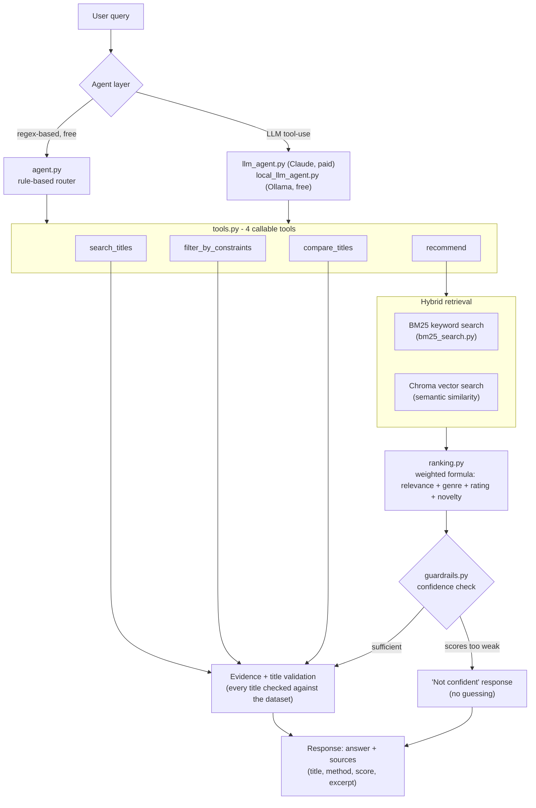

# Ask the Show

Ask the Show is an explainable AI media-discovery agent. It answers questions about movies and TV shows, compares titles, filters by constraints, and recommends things to watch — and unlike a typical chatbot, **every claim it makes is traceable to a specific retrieved piece of evidence with a score you can inspect.**

**Live demo:** [ask-the-show.streamlit.app](https://ask-the-show.streamlit.app)

## The problem

Recommendation engines and chat-based media assistants are usually black boxes: you get a suggestion with no visibility into why it was chosen, and if the assistant is LLM-powered, it can confidently reference a title that doesn't exist or state a fact that isn't true. Ask the Show is built explainable by construction rather than as an afterthought — retrieval, ranking, and every response are all structured data with a defined provenance, so "why did I get this answer" always has a concrete, inspectable answer, and there's a real guardrail for the case where the system genuinely doesn't know.

## Architecture



Everything downstream of "Agent layer" is identical regardless of which router picked the tool — the difference between `agent.py` and the LLM-routed agents is purely *how the tool call gets decided*, not what happens once it's called. See [Design Decisions](#design-decisions) for why that split exists.

## Features

- **4 tools** ([scripts/tools.py](scripts/tools.py)): `search_titles` (title/keyword lookup), `filter_by_constraints` (structured genre/year/runtime/rating filtering), `compare_titles` (structured side-by-side diff), `recommend` (hybrid retrieval + ranked suggestions)
- **3 agent routers**, same tools underneath:
  - [scripts/agent.py](scripts/agent.py) — regex/pattern-based, free, fully inspectable (every routing decision comes with a plain-English reason)
  - [scripts/llm_agent.py](scripts/llm_agent.py) — Claude tool-use, paid, most flexible on unanticipated phrasing
  - [scripts/local_llm_agent.py](scripts/local_llm_agent.py) — Ollama + Llama 3.1 8B, free and fully local, noticeably weaker tool-calling
- **Hybrid retrieval**: BM25 keyword search + Chroma vector similarity search, blended
- **Weighted ranking formula** ([scripts/ranking.py](scripts/ranking.py)): text relevance, genre match, audience rating, novelty — all tunable constants
- **Evidence on every response**: source title, retrieval method, score, and excerpt — never hidden
- **Hallucination guardrails** ([scripts/guardrails.py](scripts/guardrails.py)): a confidence threshold that declines to guess on weak retrieval, and title validation against the real dataset
- **Streamlit chat UI** ([scripts/app.py](scripts/app.py)), deployed live on Streamlit Community Cloud

## Example queries

**A comparison:**
```
> compare The Sopranos and The Wire

The Sopranos (1999) vs The Wire (2002)
Rating: 8.672 vs 8.636  (diff +0.04)
Release gap: -3 years
Shared genres: Crime, Drama

Sources:
  - The Sopranos  [source: title_match, score: n/a]
  - The Wire      [source: title_match, score: n/a]
```

**A constrained recommendation:**
```
> recommend a detective show about a murder in a small town

1. True Detective (2014) - score 0.759 [semantic 0.52, bm25 0.77, genre 1.00, rating 0.83, novelty 0.83]
2. How to Get Away with Murder (2014) - score 0.742 [semantic 0.44, bm25 0.84, genre 1.00, rating 0.78, novelty 0.83]
3. Bosch (2015) - score 0.726 [semantic 0.40, bm25 0.80, genre 1.00, rating 0.79, novelty 0.84]

Sources:
  - True Detective  [source: hybrid_semantic_bm25, score: 0.621]
    "An American anthology police detective series utilizing multiple timelines..."
```

**A deliberately vague query, triggering the guardrail:**
```
> something good

I don't have enough reliable information to answer that confidently.
Try rephrasing with more specific details - a genre, a plot description, or a title.
```

## Evaluation

Hybrid retrieval (semantic + BM25) vs. vector-only, evaluated on 20 hand-verified questions ([scripts/10_evaluate.py](scripts/10_evaluate.py), full methodology and results in [data/eval_results.md](data/eval_results.md)):


| Query type | N | Hybrid | Vector-only |
|---|---|---|---|
| Lookup | 5 | 100% | 100% |
| Comparison | 2 | 100% | 100% |
| Filter | 1 | 100% | 100% |
| Recommend | 7 | 100% | 57% |
| **Overall (retrieval, P@5)** | 15 | **100%** | **80%** |
| Guardrail correctly triggered (vague queries) | 5 | 100% | 100% |

Lookup, comparison, and filter don't touch semantic/BM25 search at all, so they score identically in both columns by design — only `recommend` and the guardrail check are actually retrieval-method-dependent.

## Setup

### Quick start — run the app (no API keys needed)

The dataset and vector index (~39MB) are committed to this repo, so you can run the app immediately without regenerating anything:

```bash
git clone https://github.com/uchechiobi/ask-the-show.git
cd ask-the-show
python3 -m venv .venv
.venv/bin/pip install -r requirements.txt
.venv/bin/streamlit run scripts/app.py
```

Opens at `http://localhost:8501`. This uses [scripts/agent.py](scripts/agent.py) (the free, rule-based router) — no `.env` file required.

### Optional: rebuild the dataset from scratch

Only needed if you want fresh TMDB data or a different catalog. Requires a free [TMDB API key](https://www.themoviedb.org/settings/api):

```bash
cp .env.example .env   # fill in TMDB_API_KEY
.venv/bin/python scripts/01_fetch_tmdb.py        # pulls ~1500 popular titles
.venv/bin/python scripts/02_fetch_wikipedia.py   # pulls plot summaries, resumable
.venv/bin/python scripts/03_chunk_and_embed.py   # chunks + embeds into Chroma
```

### Optional: LLM-routed agents

- **Claude** ([scripts/llm_agent.py](scripts/llm_agent.py)): add `ANTHROPIC_API_KEY` to `.env` (pay-per-token). Try it: `.venv/bin/python scripts/08_llm_agent_test.py`
- **Local/free** ([scripts/local_llm_agent.py](scripts/local_llm_agent.py)): install [Ollama](https://ollama.com), run `ollama pull llama3.1:8b`. Try it: `.venv/bin/python scripts/09_local_llm_agent_test.py`

### Running the evaluation

```bash
.venv/bin/python scripts/10_evaluate.py
```

## Project structure

```
ask-the-show/
├── scripts/
│   ├── 01_fetch_tmdb.py          # Day 1: TMDB ingestion
│   ├── 02_fetch_wikipedia.py     # Day 1: Wikipedia plot summaries
│   ├── 03_chunk_and_embed.py     # Day 1: chunking + Chroma embedding
│   ├── 04_query_test.py          # Day 1: raw vector-search test
│   ├── bm25_search.py            # Day 2: BM25 keyword search
│   ├── ranking.py                # Day 2: weighted ranking formula
│   ├── 05_ranked_query_test.py   # Day 2: hybrid search + ranking test
│   ├── data_access.py            # shared Chroma connection helper
│   ├── tools.py                  # Day 3: the 4 callable tools
│   ├── agent.py                  # Day 3: rule-based router
│   ├── 06_agent_test.py          # Day 3: routing test (5 query types)
│   ├── guardrails.py             # Day 4: evidence + hallucination guardrails
│   ├── 07_guardrail_test.py      # Day 4: guardrail test
│   ├── llm_agent.py              # Claude tool-use agent (paid)
│   ├── local_llm_agent.py        # Ollama tool-use agent (free)
│   ├── 08_llm_agent_test.py      # Claude agent test
│   ├── 09_local_llm_agent_test.py# Ollama agent test
│   ├── 10_evaluate.py            # Day 5: hybrid vs. vector-only evaluation
│   └── app.py                    # Day 6: Streamlit chat UI
├── data/
│   ├── tmdb_shows.json           # ~1500 titles from TMDB (committed)
│   ├── shows_with_plots.json     # + Wikipedia plots (committed)
│   ├── chroma_db/                # vector index (committed)
│   ├── eval_questions.json       # Day 5 test set (hand-written, committed)
│   └── eval_results.{json,md,png}# Day 5 output (committed)
├── .streamlit/
│   ├── config.toml               # theme (colors, fonts hook)
│   └── secrets.toml.example      # secrets pattern template
├── requirements.txt
├── .env.example
└── README.md
```

Numbered scripts (`01_` – `10_`) are things you run directly, in roughly the order they were built. Unnumbered scripts (`tools.py`, `agent.py`, `ranking.py`, `bm25_search.py`, `guardrails.py`, `data_access.py`, `llm_agent.py`, `local_llm_agent.py`) are shared modules other scripts import.

## Design Decisions

### Why hybrid retrieval over vector-only

Semantic (vector) search alone misses exact-keyword matches that don't align with how the embedding model weights meaning — the Day 5 evaluation caught this directly: queries like *"a heist gone wrong with a crew of criminals"* and *"a story about an alien creature hunting a spaceship crew"* both failed under vector-only search but passed with BM25 in the mix. Across the 20-question eval set, hybrid retrieval scored 100% (P@5) overall vs. 80% for vector-only — see [Evaluation](#evaluation). BM25 catches specific, distinctive wording; semantic search catches paraphrases and thematic similarity that don't share vocabulary. Neither alone covers both cases.

### Why the weighted ranking formula

Pure text-relevance ranking (semantic + BM25 alone) only answers "does this match what was asked" — it says nothing about whether a title is any good, fits requested constraints, or is a fresh suggestion versus something already exhausted by recommendation. The formula in [scripts/ranking.py](scripts/ranking.py) combines four signals into one explainable score:

```
final_score = 0.50 * text_relevance   (blend of semantic similarity and BM25, ratio 0.6/0.4)
            + 0.20 * genre_match      (fraction of requested genres present)
            + 0.15 * rating_score     (TMDB audience rating, normalized)
            + 0.15 * novelty_score    (recency relative to the candidate pool)
```

Every weight is a plain constant, not a learned parameter — deliberately, so the formula stays inspectable and adjustable without retraining anything. The breakdown is shown per-result in every response (see the example above), which is the point: you can see *why* something outranked something else, not just that it did.

### How the hallucination guardrails work

Two independent checks, in [scripts/guardrails.py](scripts/guardrails.py):

1. **Confidence threshold.** Before any response is generated, raw (non-pool-normalized) semantic and BM25 scores are checked against empirically calibrated thresholds (`0.40` semantic, `15.0` BM25 — calibrated by measuring score distributions for known-good vs. known-vague queries, not guessed). If neither clears the bar, the system returns "I don't have enough reliable information to answer that confidently" instead of presenting a weak match as a good one. This check is live and real in every code path, including both agent routers.

2. **Title validation.** Every response's evidence is checked against the actual dataset — any title that doesn't exist gets flagged and stripped before the response returns. Worth being precise about scope here: `agent.py`'s responses are built entirely from templated text derived directly from tool output, so nothing it says can currently reference a title outside the dataset — this check has no live failure mode to catch there, though it's real, working code, not a stub. It becomes a meaningful safeguard the moment free text enters the picture, which is exactly what `llm_agent.py` and `local_llm_agent.py` do: their generated responses are scanned for any dataset title mentioned without backing evidence and flagged if found. This was validated directly during development by feeding the checker a fabricated title.

## License

MIT — see [LICENSE](LICENSE).
