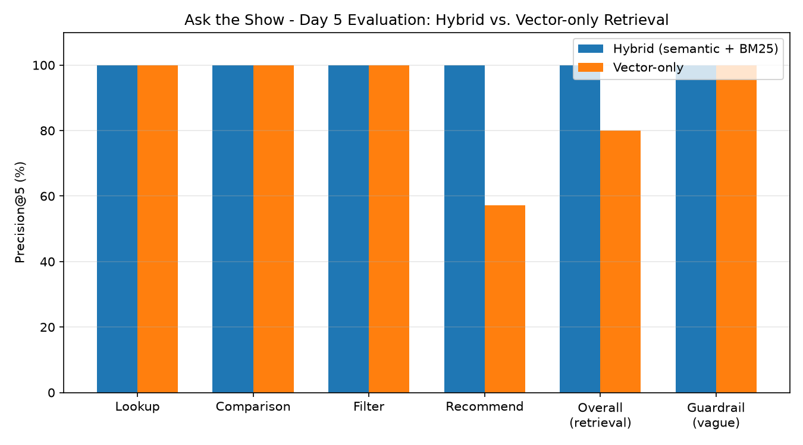

# ask-the-show
Ask the Show is an AI media-discovery agent that combines hybrid retrieval, semantic ranking, structured metadata, and grounded generation to answer questions and produce personalized television recommendations.

**Live demo:** [ask-the-show.streamlit.app](https://ask-the-show.streamlit.app)

## Evaluation

Hybrid retrieval (semantic + BM25) vs. vector-only, evaluated on 20 hand-verified questions ([scripts/10_evaluate.py](scripts/10_evaluate.py)):

Hybrid scores 100% overall (Precision@5) vs. 80% vector-only, with the gap concentrated in descriptive queries whose specific wording BM25 catches and pure semantic search misses. Full results: [data/eval_results.md](data/eval_results.md).
